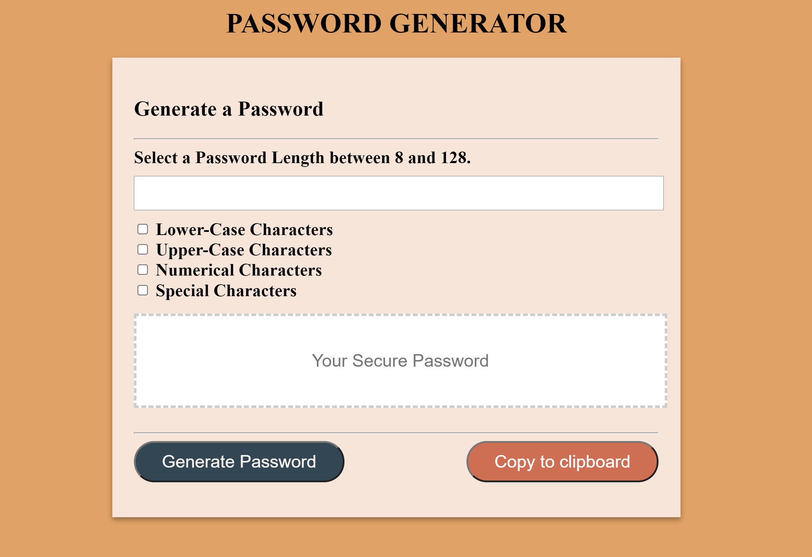

# Password-Genenerator
This is a Password Generartor build with html css and JavaScript

Please visit the deployed project at: https://dwmauricio.github.io/pw-generator/

<h1>Description</h1>
This project is a random password generator. To execute, click the "Generate Password" button and click the conditions of your password:

1) How many characters do you want in your password? (must be between 8-128 characters)

2) Select your character type (special, numeric, uppercase, lowercase) by selectiong ok in the prompt. (you must select at least one type)

3) Click "Generate Password and the password is generated in the box provided

4) Click the copy to clipboard button to copy your password.

